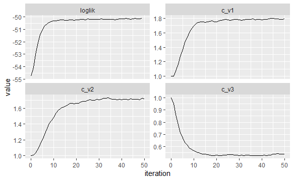

## SIRS MODEL WITH SEASONAL FORCING ##

In this noteboook I will explore how changing the seasonal drive scaling parameter changes the prevalence peak sizes in the model. This is only exploratory now, so I will adjust the parameters by hand, and observe the outcomes. If this is successful, I will try fitting the parameters with iterated filtering.

We start with the best estimates for model 8 with fixed phi. We have for now, all the c_v1, c_v2, c_v3 set to 1 as normally. 

```{r}
model8_likelihoods <- read.csv("pics_and_results/model_8_if/model8_likelihoods.csv", row.names=1)
model8_likelihoods %>% 
  filter(abs(phi-7.179000) < 0.001) %>%
  arrange(-loglik) %>%
  select(-c_v, -loglik, -loglik.se, -comment) %>% 
  head(1) -> best_params1
best_params1$c_v1 <-1
best_params1$c_v2 <-1
best_params1$c_v3 <-1


model8_likelihoods %>% 
  filter(abs(phi-7.179000) < 0.001) %>%
  arrange(-loglik) %>%
  select(loglik)%>%
  head(1) -> max_loglik1

as.data.frame(c(max_loglik1, best_params1))
```
```{r}
source("pomp_model_fn_inter_season.R")
source("aarons_params.R")

  pomp_model_fn_inter_season(site="CLU", year="all", 
                init_states= model_8_before_equ_ini,
                input_params = best_params1) -> best_params1_plots

best_params1_plots$plH
best_params1_plots$plprev
```

Now let use try c_v3 to see what happens to the third peak. We expect the third peak to change sizes increasingly aloong the four plots. 
```{r}
do.call("rbind", replicate(4, as.data.frame(best_params1), simplify = FALSE)) -> cv_params
cv_params$c_v3 <- c(0.1, 0.7, 1.5, 3)


apply(cv_params, 1, function(x)
  pomp_model_fn(site="CLU", year="all", 
                init_states= model_8_before_equ_ini,
                input_params = x)) -> cv_params_plots

for (i in 1:4){
    plot(cv_params_plots[[i]]$plprev)
  }
```
  Now let us try to match the peaks by hand. After a couple of tries and likelihood evaluations, we get the following:

```{r}
best_params1_seasonal <- best_params1
best_params1_seasonal$c_v1 <- 1.8
best_params1_seasonal$c_v2 <- 1
best_params1_seasonal$c_v3 <- 0.3


  pomp_model_fn(site="CLU", year="all", 
                init_states= model_8_before_equ_ini,
                input_params = best_params1_seasonal) -> cv_params_plots

    plot(cv_params_plots$plprev)
    plot(cv_params_plots$plH)
```

Let us calculate the likelihood of this model. 
```{r}
source("full_pomp_model_inter_season.R")
                    evals <- replicate(5,logLik(pfilter(pomp_object, params = best_params1,Np=100)))
                    ll <- logmeanexp(evals,se=TRUE)
                    c(loglik=ll[1],loglik=ll[2])
```
  The likelihood without yearly varying params was -54.9, now we have -51.5. Clearly, we can further improve this by fitting the parameter and not only varying this by hand. We can try fitting these three parameters with iterated filtering while keeping the others fixed. For burn-in period, we take c_v = 1. As we are not fitting population dynamics parameters, this is not likely to make a difference in the equilibrium. With 2500 particles and 50 iterations of filtering, we get the following plot:




  We can see a quick convergence and then only small perturbations that did not affect the likelihood much. Now let us calculate the likelihood at these values: 
```{r}
evals<- replicate(5,logLik(pfilter(mif2_object,Np=100)))
ll <- logmeanexp(evals,se=TRUE)
c(mif2_object@params["c_v1"], mif2_object@params["c_v2"], mif2_object@params["c_v3"], loglik=ll[1],loglik=ll[2])
```
  
  What is interesting that c_v1 and c_v2 are almost the same.
  Without inter-seasonality, we have loglik of -54.9, and by only fitting the three inter-seasonality params, we got a loglik of -49.9. By fitting all the parameters, I assume we will be able to get even better results. Now let us see how the fitting looks:
```{r}  
   pomp_model_fn(site="CLU", year="all", 
                init_states= model_8_before_equ_ini,
                input_params = mif2_object@params) -> cv_params_plots

    plot(cv_params_plots$plprev)
    plot(cv_params_plots$plH)
```
## SILI MODEL WITH SEASONAL FORCING ##
  
 We start with the best estimates for model 6. We have for now, all the c_v1, c_v2, c_v3 set to 1 as normally. 
```{r}
model4_likelihoods <- read.csv("pics_and_results/model_4_if/model4_likelihoods.csv", row.names=1)
model4_likelihoods %>% 
  arrange(-loglik) %>%
  select(-c_v, -loglik, -loglik.se, -comment) %>% 
  head(1) -> best_params2
best_params2$c_v1 <-1
best_params2$c_v2 <-1
best_params2$c_v3 <-1

model4_likelihoods %>% 
  arrange(-loglik) %>%
  select(loglik)%>%
  head(1) -> max_loglik
as.data.frame(c(max_loglik, best_params2))
        
```
```{r}
pomp_model_fn_inter_season(site="CLU", year="all", 
                init_states= model_4_before_equ_ini,
                input_params = best_params2) -> best_params2_plots

best_params2_plots$plH
best_params2_plots$plprev
```
 We can try fitting these three parameters with iterated filtering while keeping the others fixed. For burn-in period, we take c_v = 1. As we are not fitting population dynamics parameters, this is not likely to make a difference in the equilibrium. 
```{r}
mif2(
          pomp_object,
          params = best_params2,
          Nmif = 50,
          Np = 2500,
          cooling.fraction.50=0.5,
          cooling.type="geometric",
          rw.sd=rw.sd(c_v1=0.02, c_v2=0.02, c_v3 = 0.02)
        ) -> mif2_object

continue(mif2_object, Nmif = 50 ) -> cont_mif2_object

cont_mif2_object%>%
  traces() %>%
  melt() %>%
  filter(variable %in% c("loglik","c_v1", "c_v2", "c_v3") )%>%
  ggplot(aes(x=iteration,y=value))+
  geom_line()+
  facet_wrap(~variable,scales="free_y")+
  guides(color=FALSE) 


``` 
  Here we see a particularity of iterated filtering: the likelihood the algorithm works with is not the likelihood of the actual parameters, but the perturbed version of the model, this is why the loglik on the plot does not match our starting likelihood. This is the reason we need to calculate the loglikelihood separately after finishing the filtering.
```{r}
evals<- replicate(5,logLik(pfilter(cont_mif2_object,Np=200)))
ll <- logmeanexp(evals,se=TRUE)
c(mif2_object@params["c_v1"], mif2_object@params["c_v2"], mif2_object@params["c_v3"], loglik=ll[1],loglik=ll[2])
```

  The loglik only improved a bit, from -53.8 to -52.8, so adding these three parameters doesn't seem to describe the model better. We will need to try and fit all the parameters separately to draw conclusions. Let us plot how this model looks like:
```{r}
pomp_model_fn_inter_season(site="CLU", year="all", 
                init_states= model_4_before_equ_ini,
                input_params = mif2_object@params) -> best_params2_plots

best_params2_plots$plH
best_params2_plots$plprev
```
  Our simulated model pevalence is way below the catching data (black dots) and the third red peak is not matched very well even with our yearly changing seasonality parameter. The SIRS model was clearly a better fit.
