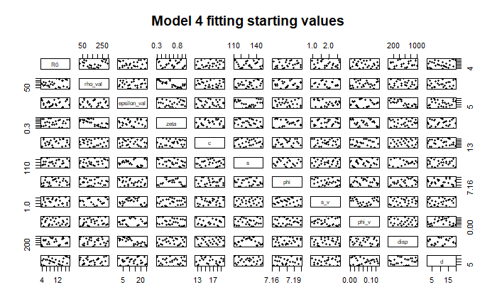
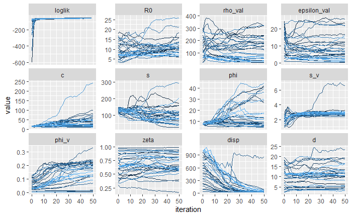
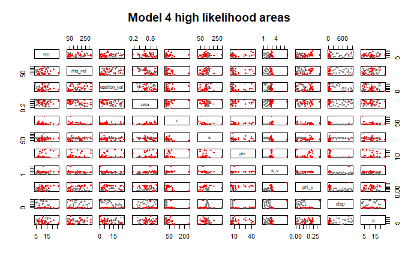
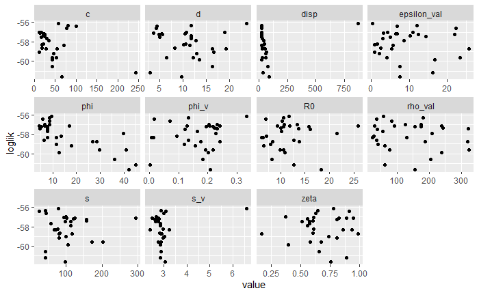

```{r}
library(foreach)
library(iterators)
library(plyr)
library(tidyr)
library(dplyr)
library(ggplot2)
library(ggpubr)
library(doParallel)
registerDoParallel(cores= 6)
library(doRNG)
registerDoRNG(625904618)
library(pomp)
```

In this notebook I examine Model 4, which is SILI with maternal immunity given by both recovered and latent states. There is a seasonal birth pulse and we fit a seasonal drive for L -> I transitions.  

  Here we are not fitting population dynamics parameters except for the birth pulse, so we also fit phi, c and s. We will later try not fitting phi and s. The params we are not fitting are at Aaron's posterior estimates, and kappa = 5000 as for the Clunes site estimates of bats are around 4000-6000. For the other params, we start the fitting with intiial values given by 5 repeats of Aaron's posterior values and 25 point from a Sobol grid of his 95% CI"
  
#

Using 2000 particles and 50 iterations with iterated filtering, we got the following results for iterated filtering:

#

  Here we see that the loglikelihood went up quickly after the first few iterations, and then stayed at around the same level. R0, rho, epsilon, phi_v (the seasonal drive shift), zeta (underroost test sensitiviy) and d (number of bats over sheet) staying in a wide range (more or less Aaron's 95% CI we started with), and did not converge much. The birth params c,s,phi diverged from our initial intervals completely. We will be fixing the latter two later on to prevent this. The two params that converged for almost all initial guesses are s_v (this affect how sharp the seasonal drive peak is) and disp (which is the dispersion parameter in our likelihood function, the smaller it is the more variance the sampling has).
  The top values are the following, the best 4 have loglik around -56. We can indeed see that we have a large range for the end parameters.
```{r}
read.csv("model4_likelihoods.csv", row.names=1) %>%
filter(comment =="Phi not fixed IF") %>%
head(5) %>%
  select (c("loglik", "R0", "rho_val", "epsilon_val",  "zeta", "c",
                         "s", "phi","s_v", "phi_v", "disp", "d"))
```
  Now we can visualise differently where our parameters converged to. The grey points are the starting values (same as on the first plot), and the red point are the results of the filtering.
  
  #


  On this plot, we look independently at the likelihoods of the resulting parameter values:

  #  
  
    Now we take the best four results and simulate with them, to see what we got:
```{r}
source("./../../pomp_model_fn.R")
source("./../../aarons_params.R")

head(model4_likelihoods, 4) %>%
  select( -c("loglik","loglik.se")) -> best_params
apply(best_params, 1, function(x)
  pomp_model_fn(site="CLU", year="all", 
                init_states= model_4_before_equ_ini,
                input_params = x)) -> best_params_plots

for (i in 1:4){
    best_params_plots[[i]] +
     geom_point( aes(x = clu_catching$min_date, y = clu_catching$hen_prevalence))+
      geom_errorbar(aes(x = clu_catching$min_date,
                        ymin = clu_catching$hen_lower, 
                        ymax = clu_catching$hen_upper)) -> plt
    plot(plt)
  }
```
We can see that none of them could really get the different sized peaks, but all got the peak locations. We will need inter-year params differing to be able to match those.     

    
### Fixing Phi ###
  
  We have now fixed phi, let's see if we have better convergence:
```{r}
mf3iter2 %>%
  traces() %>%
  melt() %>%
  filter(variable %in% c("loglik", "R0", "rho_val", "epsilon_val",  "zeta", "c",
                         "s", "phi","s_v", "phi_v", "disp", "d") )%>%
  ggplot(aes(x=iteration,y=value,group=L1,color=L1))+
  geom_line()+
  facet_wrap(~variable,scales="free_y")+
  guides(color=FALSE) -> pl1

plot(pl1)
```  

  Epsilon shows better convergence in general (except for that one particle), c's range is much much smaller now, other than that sadly nothing converged better.
  However, all the values have very good log-likelihoods:
  
    
```{r}
model4_likelihoods  %>% filter(abs(phi- 7.180000)< 0.001) %>%
  arrange(-loglik) -> model4_likelihoods_phi_fixed

head(model4_likelihoods_phi_fixed, 5) %>%
  select (c("loglik", "loglik.se", "R0", "epsilon_val", "rho_val",  "zeta", "c",
                         "s", "phi","s_v", "phi_v", "disp", "d"))
```  
  
  These are actually all better than when we have not fixed phi!
  
```{r}
gather(model4_likelihoods_phi_fixed, key, value, -loglik) %>%
  filter(key %in% c( "R0", "rho_val", "epsilon_val",  "zeta", "c",
                              "s", "phi","s_v", "phi_v", "disp", "d")) %>%
ggplot(aes(value, loglik), main = "Results of model 4 IF") + 
   geom_point() +
  facet_wrap(~ key , scales="free_x", ncol=4) -> pl4

plot(pl4)
```
  The highest values appear to be when zeta is 0.8 - 1, and d is 20-25. The highest values for s_v have also clustered together. 
      Now we take the best four results and simulate with them, to see what we got:
```{r}
source("./../../pomp_model_fn.R")
source("./../../aarons_params.R")

head(model4_likelihoods, 4) %>%
  select( -c("loglik","loglik.se")) -> best_params
apply(best_params, 1, function(x)
  pomp_model_fn(site="CLU", year="all", 
                init_states= model_4_before_equ_ini,
                input_params = x)) -> best_params_plots

catching_data <- read.csv("~/BatsProject/Australian model/data/catching_data.txt", sep="")
catching_data %>% filter(site_abbrev == "CLU") -> clu_catching
for (i in 1:4){
    best_params_plots[[i]]$plprev +
    geom_point( data= clu_catching, aes(x = min_date, y = hen_prevalence)) -> plt
    plot(plt)
    best_params_plots[[i]]$plH  -> plt
    plot(plt)
  }
```